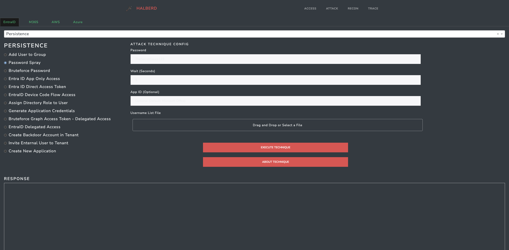

# Halberd: Multi-Cloud Security Testing Tool 🛡️

<p align="center">
  
</p>

Halberd is a powerful, multi-cloud security testing tool. Born out of the need for a unified, easy-to-use tool, Halberd enables you to proactively assess your cloud defenses by executing a comprehensive array of attack techniques across Entra ID, M365, Azure, and AWS. With its intuitive web interface, you can simulate real-world attacks, generate valuable telemetry, and validate your security controls with ease & speed.

## What's the big deal? 🤔

Halberd lets you:

- Execute attack techniques faster than you can say "cloud misconfiguration"
- Generate telemetry that'll make your SOC team beam with joy
- Validate your defenses across Entra ID, M365, Azure, and AWS
- Do it all through a slick web interface that won't make your eyes bleed

<p align="center">
  
</p>

## Features that make Halberd awesome! 😮

- 🎭 Realistic attack simulations across multiple cloud platforms
- 🧠 Smart recon dashboards for gathering intel like a pro
- 🎬 Attack playbooks to channel your inner hacker
- 📊 Insightful reports to impress your boss (or your cat)
- 🖥️ CLI access for when you're feeling extra geeky

## Getting Started: 0 to Testing in 5 Minutes ⏱️

1. Clone that repo:
   ```
   git clone https://github.com/vectra-ai-research/Halberd.git
   ```

2. Set up your playground:
   ```
   cd Halberd
   python3 -m venv venv
   source venv/bin/activate  # On Windows: venv\Scripts\activate
   pip install -r requirements.txt
   ```

3. Install Azure CLI:
   - Windows: [Official Microsoft guide](https://learn.microsoft.com/en-us/cli/azure/install-azure-cli-windows?tabs=azure-cli)
   - Linux: `curl -sL https://aka.ms/InstallAzureCLIDeb | sudo bash`
   - macOS: `brew update && brew install azure-cli`

4. Launch Halberd:
   ```
   python3 Halberd.py
   ```

5. Point your browser to `http://127.0.0.1:8050/` and start testing

## Using Halberd: Choose Your Own Adventure 🗺️

1. **Access**: Manage your tokens and sessions like a digital locksmith.
2. **Attack**: Pick your poison – surface, tactic, technique – and start your testing!
3. **Recon**: Gather intel with visual dashboards. Try the "Entity Map" for a nice visualization!
4. **Automator**: Chain attacks together like a mastermind.
5. **Trace**: Review your handiwork and generate reports.

Checkout [usage](https://github.com/vectra-ai-research/Halberd/wiki/Usage) for more information on testing with Halberd. 

Pro tip: Start with "Initial Access" under each attack surface. You can't hack what you can't reach!

## Want to Join the Party? 🎉

Got ideas? Found a bug? Want to add that one cool feature? We're all ears! Check out our [contribution guidelines](https://github.com/vectra-ai-research/Halberd/wiki/Contributions) and let's make Halberd even more awesome together.

## Who's Behind This Madness? 🕵️‍♂️

Halberd is the brainchild of [Arpan Sarkar](https://www.linkedin.com/in/arpan-sarkar/), a cloud security enthusiast with a penchant for making life harder for attackers (and easier for defenders).

## Standing on the Shoulders of Giants 🏔️

We didn't reinvent the wheel – we just made it roll smoother. Check out our [inspirations](https://github.com/vectra-ai-research/Halberd/wiki/Additional-(Amazing)-Resources) and show some love to the amazing security tools that paved the way.

Now go forth and hack responsibly! 🚀