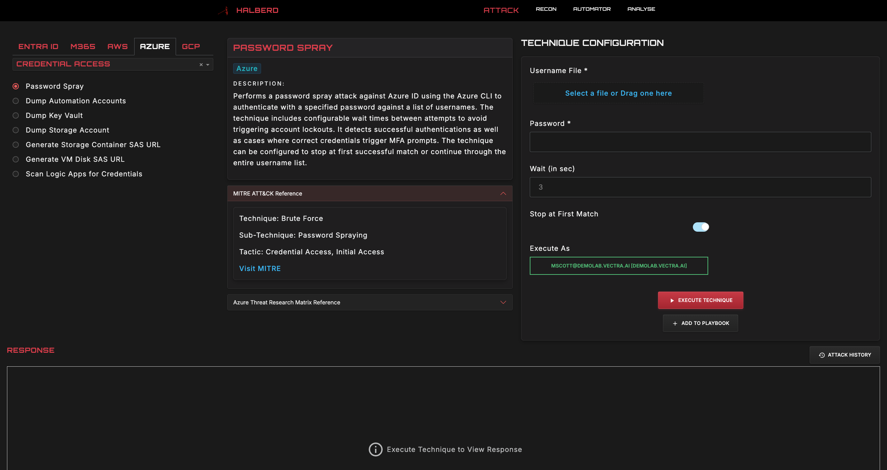

# Halberd: Multi-Cloud Security Testing Platform 🛡️

<p align="center">
  
</p>

Halberd is an advanced security testing platform that enables security teams to validate cloud security through sophisticated attack emulation. By providing comprehensive coverage across Microsoft Entra ID, Microsoft 365, Microsoft Azure, Amazon Web Services (AWS), and Google Cloud Platform (GCP), Halberd helps organizations:

* **Validate Security Controls** : Test detection and prevention capabilities across your cloud infrastructure
* **Generate Attack Telemetry**: Create realistic security events to tune and optimize your security monitoring
* **Automate Security Testing**: Build and execute complex attack chains to assess security resilience
* **Accelerate Red Team Operations**: Rapidly deploy testing scenarios through an intuitive interface

<p align="center">
  
</p>

## Key Capabilities

* 🔬 **Advanced Attack Framework**: Execute sophisticated attack techniques mapped to MITRE ATT&CK
* 🔄 **Automated Playbooks**: Execute attack playbooks and schedule tests for future continuous testing
* 📈 **Detailed Anaysis**: Review testing through interactive dashboard providing rich insights
* 📈 **Detailed Reporting & Anaysis**: Generate executive and technical reports on security testing outcomes
* 🔌 **Extensible Architecture**: Add custom techniques through a robust development framework
* 🌐 **Cross-Platform Support**: Test security controls across all major cloud providers
* 🤖 **Halberd Attack Agent**: Leverage LLM and agentic framework to supercharge security testing
* 🐳 **Docker Support**: Easy deployment with optimized container configuration

## Quick Start Guide

### Option 1: Docker Deployment (Recommended)

```bash
# Quick start with pre-built image
docker run -d --name halberd -p 8050:8050 ghcr.io/vectra-ai-research/halberd:latest

# Or build from source
git clone https://github.com/vectra-ai-research/Halberd.git && cd Halberd
docker compose up --build
```

Access the interface at `http://localhost:8050`

### Option 2: Manual Installation

1. Clone the repository:
   ```
   git clone https://github.com/vectra-ai-research/Halberd.git
   ```

2. Configure the environment::
   ```
   cd Halberd
   python3 -m venv venv
   source venv/bin/activate  # On Windows: venv\Scripts\activate
   pip install -r requirements.txt
   ```

3. Install Azure CLI:
   * Windows: [Official Microsoft guide](https://learn.microsoft.com/en-us/cli/azure/install-azure-cli-windows?tabs=azure-cli)
   * Linux: `curl -sL https://aka.ms/InstallAzureCLIDeb | sudo bash`
   * macOS: `brew update && brew install azure-cli`

4. Launch Halberd:
   ```
   python3 run.py
   ```

5. Access the interface at `http://127.0.0.1:8050/` and begin testing

> Optionally, see steps to enable Halberd Attack Agent [here](https://github.com/vectra-ai-research/Halberd/wiki/Deployment-Guide#setup-halberd-attack-agent)

#### Advanced Deployment Options

```
# Custom Host & Port
python3 run.py --host 0.0.0.0 --port 8050

# Enable TLS
python3 run.py --ssl-cert /path/to/cert.pem --ssl-key /path/to/key.pem

# Configure Logging
python3 run.py --log-level debug

# Development Mode
python3 run.py --dev-server --dev-server-debug
```

## Core Workflows

1. **Attack Execution & Testing**:
   * Select target environment (Entra ID/M365/Azure/AWS/GCP)
   * Browse techniques by MITRE ATT&CK tactics
   * Execute attacks across multiple clouds
   * Manage access with built-in access manager
   * View results with rich output formatting
   * Generate attack telemetry

2. **Attack Automation**:
   * Create automated attack playbooks
   * Chain multiple techniques into attack sequences
   * Import/Export playbooks for sharing
   * Schedule recurring security tests

3. **Security Analysis**:
   * Track testing metrics through intuitive dashboards
   * Visualize attack paths and impact
   * Identify security gaps
   * Generate comprehensive test reports
   * Export results for compliance evidence

For detailed usage instructions, visit [Halberd Wiki - Usage](https://github.com/vectra-ai-research/Halberd/wiki/Usage).

## Docker Deployment Details

### Advanced Docker Options

```bash
# With persistent volumes for data retention
docker run -d \
  --name halberd \
  -p 8050:8050 \
  -v $(pwd)/local:/app/local \
  -v $(pwd)/output:/app/output \
  -v $(pwd)/report:/app/report \
  ghcr.io/vectra-ai-research/halberd:latest

# Custom configuration
docker run -d \
  --name halberd \
  -p 8080:8080 \
  -e HALBERD_HOST=0.0.0.0 \
  -e HALBERD_PORT=8080 \
  ghcr.io/vectra-ai-research/halberd:v2.2.0
```

### Docker Features

- **Multi-stage builds**: Optimized container size with separate build and runtime stages
- **Security hardened**: Runs as non-root user with minimal attack surface
- **Health checks**: Built-in health monitoring for container orchestration
- **Resource limits**: Configurable CPU and memory constraints via docker-compose
- **Multi-architecture**: Supports both AMD64 and ARM64 platforms
- **Automated builds**: CI/CD pipeline automatically builds and publishes images to GitHub Container Registry

### Available Tags

- `latest` - Latest stable release from main branch
- `v2.2.0` - Specific version release
- `main` - Latest development build

## Want to Join the Party? 🎉

Got ideas? Found a bug? Want to add that new cool feature? Check out the [contribution guidelines](https://github.com/vectra-ai-research/Halberd/wiki/Contributions) and let's make Halberd even more awesome together.

## About
Halberd is developed by [Arpan Sarkar](https://www.linkedin.com/in/arpan-sarkar/) and is [inspired](https://github.com/vectra-ai-research/Halberd/wiki/Additional-(Amazing)-Resources) by the excellent work of the cloud security community.

***
**Now go forth and hack responsibly! 🚀**